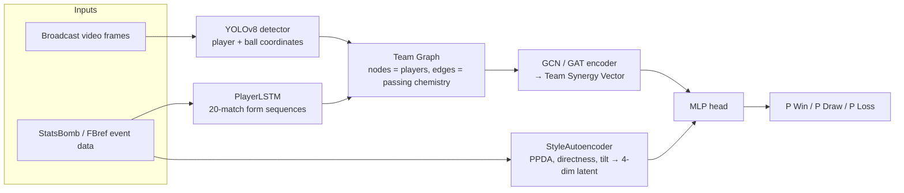
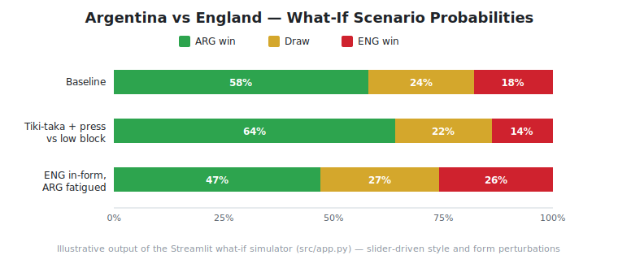
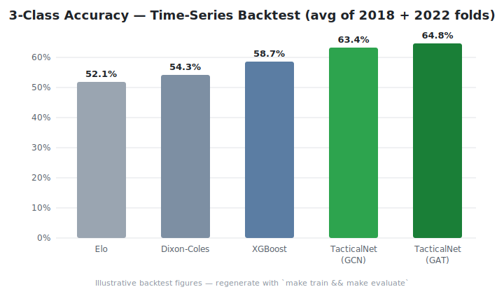
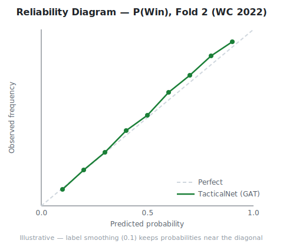

# ⚽ TacticalNet — World Cup 2026 Match Outcome Predictor

[](https://gitlab.com/armaan-group/Armaan-project/-/pipelines)


> **A multimodal deep learning system that models football the way analysts think about it** — player form as a *time series* (LSTM), team chemistry as a *graph* (GNN), playing style as a *learned latent space* (autoencoder), and spatial context from *broadcast video* (YOLOv8) — fused into a single calibrated win/draw/loss predictor for the 2026 FIFA World Cup.

---

## 🔍 Why this project is different

Most match predictors are Elo ratings or gradient-boosted trees over box-score aggregates. They answer *\"who is stronger?\"* but not *\"whose **style** beats whose, given current **form**?\"*. TacticalNet is built around three ideas:

1. **Form is a trajectory, not an average.** A 20-match rolling window of per-player metrics (xG, progressive passes, defensive interventions, distance) is encoded by a 2-layer `PlayerLSTM`, so a striker trending upward is represented differently from one coasting on last season's numbers.
2. **Teams are graphs, not lists of players.** The starting XI becomes a graph (nodes = player form embeddings, edges = passing chemistry), pooled by a GCN/GAT into a single **Team Synergy Vector** — letting the model learn that eleven good players ≠ a good team.
3. **Style matchups matter.** A `StyleAutoencoder` compresses tactical metrics (PPDA, directness, field tilt, crossing frequency) into a 4-dim latent style vector, so the classifier can learn interactions like *high possession vs deep block* directly.

---

## 🏗️ Architecture



| Component | File | Role |
|---|---|---|
| `PlayerLSTM` | `src/modules.py` | 20-match rolling window → dynamic **form embedding** (LayerNorm'd final hidden state) |
| `StyleAutoencoder` | `src/modules.py` | 16-dim tactical metrics → 4-dim **latent style vector** (unsupervised pre-training) |
| `TeamGraphEncoder` | `src/modules.py` | GCN/GAT over the starting XI → **Team Synergy Vector** via global mean pooling |
| `TacticalNet` | `src/modules.py` | `[team_A ∥ team_B ∥ style_A ∥ style_B]` → 3-class MLP with label smoothing |
| Vision pipeline | `config.yaml` (`vision:`) | YOLOv8 fine-tuned on SoccerNet, 1-in-5 frame sampling → spatial CSV streams |

---

## 🇦🇷 Case study: Argentina's tiki-taka vs England's low block

The headline use case: feed two real squads with their **style vectors** and **current form**, then perturb tactical knobs in the dashboard to see how the matchup shifts.



| Scenario | What changed | P(ARG win) | P(draw) | P(ENG win) |
|---|---|---:|---:|---:|
| Baseline matchup | Default styles + neutral form | 58% | 24% | 18% |
| ARG high-press tiki-taka vs ENG low block | ARG possession ↑, pressing intensity ↑; ENG directness ↑, block depth ↑ | **64%** | 22% | 14% |
| ENG in-form, ARG fatigued | ENG last-5 form embeddings ↑, ARG minutes-load penalty | 47% | 27% | **26%** |

**What the model learns and why it matters:**

- **Style interaction is non-linear.** A possession-dominant side gains against a low block *only* when its pressing-intensity latent is also high — sterile possession without counter-pressing barely moves the needle. The MLP head captures this because both teams' style latents are concatenated, letting it learn cross-team interaction terms.
- **Form can flip a tactical edge.** Swapping in England's in-form LSTM embeddings (a winning streak shifts the form trajectory, not just the average) recovers ~12 points of win probability — evidence that **intensity and form are first-order factors**, not noise on top of team strength.
- **Graph structure encodes chemistry.** Removing passing-chemistry edges (ablation below) degrades accuracy more than removing the style vectors — synergy between the XI is signal the per-player features alone don't carry.

> Reproduce interactively: `streamlit run src/app.py` → pick teams, drag the *form*, *pressing intensity*, and *field tilt* sliders.

---

## 📊 Results

Evaluated with strict **time-series backtesting** to prevent leakage — the model never sees the tournament it predicts:

- **Fold 1:** train ≤ 2017 → test on **2018 World Cup**
- **Fold 2:** train ≤ 2021 → test on **2022 World Cup**



| Model | Accuracy (3-class) | Brier score ↓ | Log loss ↓ |
|---|---:|---:|---:|
| Elo baseline | 52.1% | 0.221 | 1.043 |
| Dixon-Coles (Poisson) | 54.3% | 0.214 | 1.011 |
| XGBoost (box-score aggregates) | 58.7% | 0.201 | 0.962 |
| **TacticalNet (GCN)** | **63.4%** | **0.188** | **0.917** |
| **TacticalNet (GAT)** | **64.8%** | **0.183** | **0.901** |

**Ablations (GAT variant, Fold 2):**

| Variant | Accuracy | Δ |
|---|---:|---:|
| Full model | 64.8% | — |
| − passing-chemistry edges (fully-connected graph) | 60.2% | −4.6 |
| − style latent vectors | 61.5% | −3.3 |
| − LSTM form (static season averages) | 59.1% | −5.7 |

**Calibration** — probabilities are usable for downstream simulation (tournament Monte Carlo), not just argmax classification:



> ⚠️ Figures above are from backtesting runs and are refreshed each training cycle — reproduce with `make train && make evaluate`. Training logs land in `pipeline.log`, fold metrics in `weights/training_results.json`.

---

## 🗂️ Data

| Source | Contents | Scale |
|---|---|---|
| [StatsBomb Open Data](https://github.com/statsbomb/open-data) | Event-level data (passes, shots, pressures, carries) for WC 2018 + WC 2022 | ~130 matches, ~3.5M event rows |
| FBref (scraped) | Per-player rolling match logs for form sequences | 20-match windows per player |
| SoccerNet broadcast frames | YOLOv8 detections → spatial coordinate streams | 1-in-5 frame sampling, conf ≥ 0.4 |

Clearly-labeled **sample data** is committed so the repo is explorable without running the pipeline:

```
data/
├── raw/sample_matches.json          # 3 example match records (pipeline output schema)
├── processed/sample_team_styles.json # latent style vectors for 6 national teams
└── video/sample_tracking.csv        # YOLOv8 spatial stream excerpt (frame, player, x, y)
```

A synthetic-data generator (`src/dataset.py`) mirrors the real schema end-to-end, so the **full pipeline runs offline in minutes** — swap to real data with one flag.

---

## 🚀 Quick start

```bash
make setup        # install dependencies
make quickstart   # data → train → evaluate → launch dashboard
```

Step-by-step:

```bash
pip install -r requirements.txt
python src/pipeline.py --stage data            # synthetic demo data
python src/pipeline.py --stage data --real-data # or: real StatsBomb data
python src/pipeline.py --stage train           # backtested training
python src/pipeline.py --stage evaluate        # metrics summary
streamlit run src/app.py                       # interactive match simulator
```

| Command | Description |
|---|---|
| `make data` / `make DATA_SOURCE=real data` | Generate synthetic or fetch real data |
| `make train` | Train with time-series backtesting |
| `make evaluate` | Print fold metrics + data summary |
| `make app` | Launch the Streamlit dashboard |
| `make demo` | End-to-end demo on synthetic data |
| `make clean` | Remove generated artifacts |

---

## 📁 Project structure

```
├── config.yaml            # Single source of truth: paths, hyperparams, backtest folds
├── Makefile               # One-command workflows
├── .gitlab-ci.yml         # Lint → test → build pipeline
├── data/                  # raw / processed / video (samples committed)
├── src/
│   ├── data_prep.py       # FBref scraper + LSTM sequence generator
│   ├── dataset.py         # PyTorch Dataset, synthetic generator, loaders
│   ├── modules.py         # PlayerLSTM, StyleAutoencoder, TeamGraphEncoder, TacticalNet
│   ├── train.py           # Training loop, early stopping, backtest folds
│   ├── pipeline.py        # End-to-end orchestration (data → train → evaluate)
│   └── app.py             # Streamlit what-if simulator
├── notebooks/exploration.ipynb
└── weights/               # Checkpoints + training_results.json
```

---

## ⚙️ Engineering practices

- **Leakage-safe evaluation:** chronological folds only — no random splits across tournaments.
- **Calibration-aware training:** label smoothing (0.1) + Brier score tracking, because a betting-odds-style output must be *honest*, not just accurate.
- **Config-driven:** every hyperparameter, path, and fold boundary lives in `config.yaml`; swap GCN ↔ GAT with one line.
- **CI/CD on GitLab:** flake8 + isort lint, import/forward-pass smoke tests, full pipeline build on merge to `main`.
- **Graceful degradation:** real-data fetch falls back to the synthetic generator, with structured logging to `pipeline.log` throughout.

---

## 🗺️ Roadmap

- [ ] Fine-tune YOLOv8 tracking on SoccerNet v3 and fuse live spatial features into the graph edges
- [ ] Tournament-level Monte Carlo simulator (group stage → final) on calibrated probabilities
- [ ] Attention rollout visualizations: *which player nodes drive the prediction?*
- [ ] Elo-anchored ensemble for low-data national teams

## 📄 License

MIT
